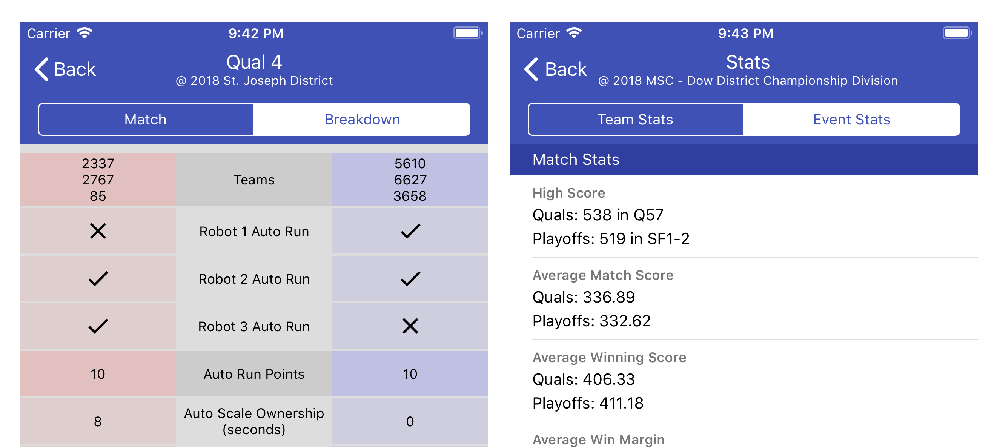

The Blue Alliance - Rect Native
===

React Native code used in The Blue Alliance's iOS app



Setup
===
The React Native codebase needs a few dependencies to get setup. The commands below suggest [Homebrew](https://brew.sh/) to install the dependencies. If you're trying to get the codebase setup on Linux or Windows, follow the links to find platform-specific setup instructions.

Build Tool Dependencies
---
1. Install [Node/npm](https://nodejs.org/en/) and [Watchman](https://facebook.github.io/watchman/docs/install.html)
    * `brew install node watchman`
2. Install [React Native](https://facebook.github.io/react-native)
    * `npm install -g react-native-cli`
3. Clone this repository and navigate to the cloned project
    * `git clone https://github.com/the-blue-alliance/the-blue-alliance-react.git`
    * `cd the-blue-alliance-react`
4. Install project dependencies
    * `npm install`

Developing Locally
===
You can test the React Native code locally with [The Blue Alliance for iOS](https://github.com/the-blue-alliance/the-blue-alliance-ios) running in a simulator. Start the React Native server and navigate to the corresponding view in the app (Match Breakdown or Event Stats).

* Start server: `react-native start`
* To view RN logs: `react-native log-ios`
* Debugging is easier if you install [react-devtools](https://github.com/facebook/react-devtools/tree/master/packages/react-devtools)


Building
===
For compiling the React Native bundle to be used offline. The iOS app expects the hosted files to be zipped in a file called `ios.zip`

```
$ mkdir ios
$ react-native bundle --platform ios --dev false --assets-dest ios --entry-file index.ios.js --bundle-output ios/main.jsbundle --reset-cache
$ zip -r ios.zip ios/
```

Contributing
============

Want to add features, fix bugs, or just poke around the code? No problem!

Project Communication 
---
 - Keep up to date with the [mailing list](https://groups.google.com/forum/#!forum/thebluealliance-developers).
 - Chat with us on our [Slack team](https://the-blue-alliance.slack.com/). (Request an invite in the mailing list.)
