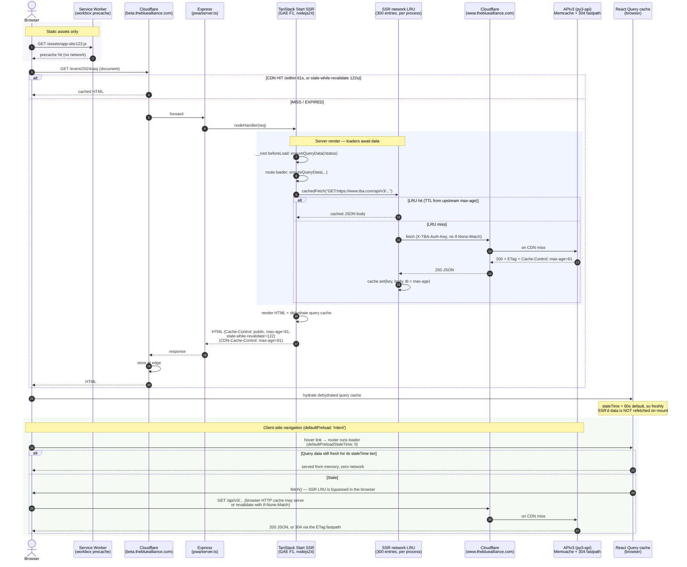

# PWA Caching Lifecycle

How a request for a PWA page is served, and which cache answers it at each hop.
Everything here is derived from the code in `pwa/`; the API-side layers
(Cloudflare on `www`, Memcache, the 304 fastpath) are shown only as the far end
of the chain.

The PWA is served at `beta.thebluealliance.com` (`src/dispatch.yaml`) and fetches
data from `https://www.thebluealliance.com/api/v3`
(`pwa/app/api/tba/read/client.gen.ts`), so **every API call — from the SSR server
and from the browser alike — crosses the public internet and hits Cloudflare in
front of `www`.**

## The five caches

| # | Cache | Where it lives | Scope | Lifetime | Code |
|---|-------|----------------|-------|----------|------|
| 1 | Workbox precache | Browser (service worker) | Per browser | Until next deploy | `pwa/scripts/generate-sw.ts` |
| 2 | Browser HTTP cache | Browser | Per browser | `max-age=61` from the API | (implicit — plain `fetch`) |
| 3 | Cloudflare edge | CDN in front of `beta` and `www` | Global | `CDN-Cache-Control: max-age=61` | `publicCacheControlHeaders()` in `pwa/app/lib/utils.tsx:330` |
| 4 | SSR network LRU | GAE `pwa` Node process | Per instance, **all users** | Response `max-age`, default 61s | `pwa/app/lib/middleware/network-cache.ts` |
| 5 | TanStack Query cache | Browser (hydrated from SSR) | Per tab | `staleTime` tier | `pwa/app/lib/queryClient.ts` |

## Full lifecycle



## Layer notes

### 1. Service worker — static assets only

`scripts/generate-sw.ts` runs Workbox `generateSW` at build time over
`build/client`, precaching `js/css/html/png/jpg/svg/woff/woff2/ico` up to 2 MB
each under cache id `tba-pwa`, with `skipWaiting`, `clientsClaim`, and
`cleanupOutdatedCaches`.

There is **no `runtimeCaching` config**. The service worker therefore never
intercepts API calls or SSR documents — it is a precache for the build output and
nothing more. There is also no `navigateFallback`, so there is no offline shell.
Registration is PROD-only (`app/lib/serviceWorkerRegistration.ts`, called from
`getRouter()`).

### 2. Express static headers

`pwa/server.ts` sets, before the SSR handler:

- `/assets` → `immutable, max-age=1y` (Vite fingerprints these)
- `/favicon.ico` → 1 week
- `/sw.js` → `Cache-Control: no-cache`
- everything else in `build/client` → 24 hours

The SSR handler itself sets no cache headers; those come from the routes.

### 3. Cloudflare / document caching

`cacheControlHeadersForSeason(season)` (`app/lib/utils.tsx`) returns `{}` outside
production, and in production picks one of two tiers:

```
current season:  Cache-Control:     public, max-age=61, stale-while-revalidate=600
                 CDN-Cache-Control: max-age=61, stale-while-revalidate=600

past season:     Cache-Control:     public, max-age=86400, stale-while-revalidate=604800
                 CDN-Cache-Control: max-age=86400, stale-while-revalidate=604800
```

Routes that know their season call it inline so TanStack still infers `params`
from the route itself:

```ts
headers: ({ params }) =>
  cacheControlHeadersForSeason(seasonFromKey(params.matchKey)),
```

Routes with no season in the URL use `publicCacheControlHeaders()`, which is the
current-season (short) tier. An unknown season always resolves to the short tier.

**Why `stale-while-revalidate` appears in `CDN-Cache-Control` too:** Cloudflare
prefers `CDN-Cache-Control` over `Cache-Control`, so while the directive was only
on the latter, the edge did a *blocking* origin revalidation the moment `max-age`
lapsed. Measured by polling one URL every 15s: `HIT` through age 60s, then
`EXPIRED` at 61s — never a stale serve, at a cost of ~0.5s versus ~0.03s for a hit.

Because the response is `public`, a rendered page is shared across all visitors at
the edge — correct today because SSR renders no per-user content, and a constraint
to remember if that ever changes.

**Serving stale documents is only safe because of layer 5.** React Query keeps the
server's original `dataUpdatedAt` through dehydration, so a page rendered from a
stale edge copy refetches on mount. That correction only exists for data read via
`useQuery`/`useSuspenseQuery`; a component reading `useLoaderData()` renders the
snapshot forever. Every route on the long tier must read from the query cache.

### 4. SSR network LRU — the layer most people are asking about

Installed in `app/routes/__root.tsx:87`, guarded by `typeof window === 'undefined'`,
onto the **read client only**. The mobile, colors, and moderation clients do not
get it.

```ts
if (typeof window === 'undefined') {
  client.setConfig({ fetch: createCachedFetch({ cacheableMethods: ['GET'] }) });
}
```

`app/lib/middleware/network-cache.ts`:

- A **module-global** `LRUCache`, so it is shared by every request and every user
  handled by that GAE instance. Cold instance = cold cache; `max_idle_instances: 1`
  and F1 instance class mean this happens often.
- `max: 300` entries. The cap is deliberate — a heavy page (district stats) can
  fan out 20–40 entries, but the whole LRU sits in the F1 instance's memory
  (see #9984).
- Freshness is computed **in the middleware**, not by the LRU: each entry stores
  `fetchedAt` and `freshForMs` (the upstream `max-age`, falling back to 61s with a
  warning). The `LRUCache` is constructed with no `ttl` at all, so an entry past
  its freshness window stays reachable instead of being dropped at the boundary —
  which is what makes serve-stale possible. The LRU's remaining job is bounding
  memory.
- Cache key is `METHOD:url` — **no auth identity**. Safe only because TBA read
  data is public and there is a single shared `X-TBA-Auth-Key`. Per-user keys
  would make this a cross-user leak.
- A second `typeof window !== 'undefined'` guard inside `cachedFetch` makes the
  browser path a plain `fetch` even if the config ever leaked to the client.
- Counters go to Sentry as `network.cache.hit` / `network.cache.miss` with an
  `outcome` attribute (`fresh`, `stale_served`, `miss`) plus
  `network.cache.revalidation` (`not_modified`, `replaced`, `error`), and are
  exposed at `/local/debug` via `getCacheStats()` / `getCacheEntries()`.

**Serve-stale and revalidation.** A read resolves one of three ways:

| Entry state | Behavior |
|---|---|
| Fresh (`age < freshForMs`) | Served immediately, no network |
| Stale within ceiling | Served immediately, conditional revalidation fired **behind** the response |
| Stale past ceiling, or absent | Blocks on the network |

The stale ceiling is tiered like the edge headers, from the season parsed out of
the API URL (`seasonFromPath`): **24h** for past seasons, **5min** for the current
season.

Revalidation re-issues the request with `If-None-Match` from the stored ETag, so
the APIv3 304 fastpath (#10545) answers with no body and no Datastore read. It is
deliberately **not awaited**: measured against the live API, a `304` (~0.03s) and
a `200` (~0.03s, 287KB) are within noise of each other when Cloudflare has the
response cached — the round trip, not the payload, is the cost. Putting
revalidation on the critical path would buy bandwidth at the price of latency.
Concurrent stale reads for one key are deduped through an in-flight map, so a hot
key fires one revalidation rather than up to `max_concurrent_requests` (80).

Historically this layer discarded the upstream `ETag` and never sent
`If-None-Match`, so the APIv3 304 fastpath did **nothing** for SSR traffic — every
miss was a full 200 with a full JSON body, and the measured hit rate sat at 21.4%
(45,075 hits against 165,105 misses over 7 days).

### 5. TanStack Query — the client's freshness authority

`setupRouterSsrQueryIntegration` (`app/router.tsx:76`) dehydrates the server's
query cache into the HTML and rehydrates it in the browser.

`createQueryClient()` sets `staleTime: STALE_TIME.DEFAULT` globally. This is what
prevents the hydration refetch storm: with the library default of `0`, every
`useSuspenseQuery` would treat the data the server just embedded as instantly
stale and refetch it on mount.

Tiers in `app/lib/queryClient.ts`:

| Tier | Value | Used for |
|------|-------|----------|
| `DEFAULT` | 60s | Anything current; matches the API's `max-age=61` |
| `HISTORICAL` | 1h | Immutable past-season data; picked by `staleTimeForYear()` (pure calendar comparison, not `/status`) |
| `STATUS` | 6h | `/status`, awaited once in the root `beforeLoad` |
| `SEARCH_INDEX` | 24h | `/search_index`, prefetched client-only and deliberately not dehydrated (#10254) |

Live data (in-progress matches, rankings) stays on a low `staleTime` and uses an
explicit `refetchInterval`, which fires independently of `staleTime` — see the
district champs route.

Failure handling lives here too: `retry` skips 4xx (an `ApiError` with status
400–499 will not be retried), and the `QueryCache.onError` hook is the single seam
that logs and reports to Sentry, skipping 404s as "legitimately absent".

### Router preloading

`defaultPreload: 'intent'` with `defaultPreloadStaleTime: 0` means the router
always invokes loaders on hover/touch and lets React Query's `staleTime` decide
whether that turns into a network request. Preloading a page whose data is still
fresh costs nothing.

## Where a given request actually gets answered

- **Repeat visitor, page inside its edge `max-age`** → Cloudflare edge, no GAE
  instance involved (~0.03s vs ~0.5s for a miss). For past-season pages that
  window is 24h, not 61s.
- **Repeat visitor, page inside the edge stale window** → edge serves the stale
  copy and revalidates behind it; the client corrects anything past its
  `staleTime` on hydration.
- **Cold page, warm instance** → SSR renders; API calls are served fresh from the
  in-process LRU, or served stale with a background 304 revalidation.
- **Cold page, cold instance** → SSR renders, every API call goes to Cloudflare
  on `www` and possibly through to Datastore.
- **Client-side navigation, data fresh** → React Query memory, zero network.
- **Client-side navigation, data stale** → browser `fetch` → browser HTTP cache
  or Cloudflare on `www` → APIv3 (where the ETag 304 fastpath applies).
